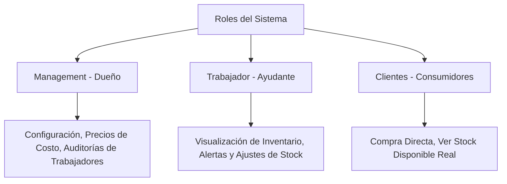

# Mejora 1: Gestión de Stock y Alertas de Inventario Crítico

Esta mejora dota al sistema de control preciso sobre las existencias de productos físicos, definiendo accesos diferenciados para el **Dueño (Management)**, el **Ayudante (Trabajador)** y los **Compradores (Clientes)**.

---

## 1. Funcionamiento del Backend (Base de Datos y Sistemas)

### Cambios en el Esquema de Supabase (SQL)
Modificaremos la tabla `products` para agregar soporte de stock físico y alertas, y crearemos una tabla de historial para auditorías de inventario que registre qué usuario (sea dueño o trabajador) realizó los movimientos.

```sql
-- 1. Extensión de la tabla de productos existente
ALTER TABLE public.products
  ADD COLUMN IF NOT EXISTS stock_quantity integer DEFAULT 0 CHECK (stock_quantity >= 0),
  ADD COLUMN IF NOT EXISTS min_stock_alert integer DEFAULT 5 CHECK (min_stock_alert >= 0),
  ADD COLUMN IF NOT EXISTS track_inventory boolean DEFAULT true,
  ADD COLUMN IF NOT EXISTS cost_price numeric(10,2) DEFAULT 0.00 CHECK (cost_price >= 0);

-- 2. Tabla de historial de movimientos de inventario (Auditoría)
CREATE TABLE public.inventory_transactions (
  id uuid DEFAULT gen_random_uuid() PRIMARY KEY,
  tenant_id uuid NOT NULL REFERENCES public.tenants(id) ON DELETE CASCADE,
  product_id uuid NOT NULL REFERENCES public.products(id) ON DELETE CASCADE,
  quantity_changed integer NOT NULL, -- Positivo (+) entradas, Negativo (-) salidas
  transaction_type text NOT NULL CHECK (transaction_type IN ('sale', 'purchase', 'adjustment', 'return')),
  reference_id uuid, -- ID opcional del pedido o compra
  notes text,
  created_at timestamp with time zone DEFAULT timezone('utc'::text, now()),
  created_by uuid REFERENCES public.profiles(id) ON DELETE SET NULL
);

-- Habilitar RLS en la tabla de transacciones de inventario
ALTER TABLE public.inventory_transactions ENABLE ROW LEVEL SECURITY;
```

### Seguridad y Aislamiento por Roles (Políticas RLS)
Definimos los permisos estrictos para cada rol:

```sql
-- Políticas para productos (Tabla products)
-- Clientes: Solo pueden ver productos activos (lectura)
CREATE POLICY "Clients can view active products"
  ON public.products FOR SELECT USING (is_active = true);

-- Trabajadores: Pueden ver todos los productos y actualizar la cantidad de stock
CREATE POLICY "Workers can view and update product stock"
  ON public.products FOR ALL USING (
    EXISTS (
      SELECT 1 FROM public.workers
      WHERE workers.tenant_id = products.tenant_id
      AND workers.profile_id = auth.uid()
    )
  );

-- Management (Dueño): Control absoluto e ilimitado sobre productos, precios y configuración de stock
CREATE POLICY "Managers have full access to products"
  ON public.products FOR ALL USING (
    EXISTS (
      SELECT 1 FROM public.tenants
      WHERE tenants.id = products.tenant_id
      AND tenants.owner_id = auth.uid()
    )
  );

-- Políticas para el Historial de Inventario (Tabla inventory_transactions)
-- Clientes: No tienen acceso al historial de movimientos (Políticas restrictivas implícitas)

-- Trabajadores: Pueden ver el historial de transacciones y registrar ajustes manuales
CREATE POLICY "Workers can view and insert inventory transactions"
  ON public.inventory_transactions FOR SELECT OR INSERT WITH CHECK (
    EXISTS (
      SELECT 1 FROM public.workers
      WHERE workers.tenant_id = inventory_transactions.tenant_id
      AND workers.profile_id = auth.uid()
    )
  );

-- Management (Dueño): Control y auditoría completa de todas las transacciones de inventario
CREATE POLICY "Managers have full access to inventory transactions"
  ON public.inventory_transactions FOR ALL USING (
    EXISTS (
      SELECT 1 FROM public.tenants
      WHERE tenants.id = inventory_transactions.tenant_id
      AND tenants.owner_id = auth.uid()
    )
  );
```

### Automatización en Base de Datos (Disminución Automática de Stock)
Cuando un pedido se aprueba, se descuenta de forma segura del stock físico a través del backend:

```sql
CREATE OR REPLACE FUNCTION public.handle_order_stock_deduction()
RETURNS TRIGGER AS $$
DECLARE
  item RECORD;
BEGIN
  -- Solo deducir cuando el pedido es aprobado (de 'pending' a 'approved')
  IF NEW.status = 'approved' AND OLD.status = 'pending' THEN
    FOR item IN 
      SELECT product_id, quantity 
      FROM public.order_items 
      WHERE order_id = NEW.id
    LOOP
      -- Validar si el producto lleva control de inventario
      UPDATE public.products
      SET stock_quantity = stock_quantity - item.quantity
      WHERE id = item.product_id AND track_inventory = true;

      -- Registrar auditoría
      INSERT INTO public.inventory_transactions (
        tenant_id, product_id, quantity_changed, transaction_type, reference_id, notes, created_by
      )
      VALUES (
        NEW.tenant_id, item.product_id, -item.quantity, 'sale', NEW.id, 
        'Descuento automático por aprobación de orden N° ' || NEW.id, NEW.client_id
      );
    END LOOP;
  END IF;
  RETURN NEW;
END;
$$ LANGUAGE plpgsql SECURITY DEFINER;

CREATE TRIGGER on_order_approved_deduct_stock
  AFTER UPDATE OF status ON public.orders
  FOR EACH ROW
  EXECUTE FUNCTION public.handle_order_stock_deduction();
```

---

## 2. Funcionamiento del Frontend (UI/UX)

### Interfaces de Usuario por Rol



#### A. Vista de Management (Dueño del Negocio)
* **Pantalla de Inventario Crítico:** En su dashboard (`management_home_screen.dart`), visualiza una tarjeta premium de alertas que destaca la cantidad de productos en stock bajo (ej. `3 productos por vencer inventario`). Al hacer clic, se abre una lista detallada.
* **Formulario de Productos Completo:**
  - Puede definir el **Costo de Compra** (`cost_price`), el **Precio de Venta**, la cantidad inicial y habilitar o deshabilitar el rastreo de inventario.
  - Configura el umbral de alerta (`min_stock_alert`) de manera individual.
* **Auditoría de Historial de Stock:**
  - Puede inspeccionar una cronología detallada que detalla exactamente qué **Trabajador** realizó un ajuste (ej. *"Ajuste manual de +15 unidades por Trabajador: Carlos López"*).

#### B. Vista de Trabajador (Ayudante del Dueño)
* **Acceso Limitado a Pantallas de Inventario:**
  - Puede ver la lista de productos y filtrar por aquellos con bajo stock para rellenar estanterías.
  - **Acción Rápida de Ajuste:** Un botón rápido con ícono de llave de tuercas para registrar ajustes manuales (ej. por producto dañado o inventario inicial) indicando el motivo en un campo de texto obligatorio.
  - **Restricción UI:** No puede editar el costo de compra del producto ni ver el margen de ganancia en esta pantalla para proteger el secreto de negocio del dueño.

#### C. Vista del Cliente (Usuarios de la Tienda Web)
* **Catálogo en Tiempo Real:**
  - Las tarjetas de producto muestran de forma clara y sutil la disponibilidad. Si un artículo tiene stock limitado (cerca del stock mínimo), muestra un badge de color naranja: *"¡Pocas unidades disponibles!"*.
  - Si el stock es 0, el botón de "Añadir al Carrito" se deshabilita automáticamente y muestra el texto *"Agotado"*, impidiendo que el cliente realice pedidos de productos inexistentes.
