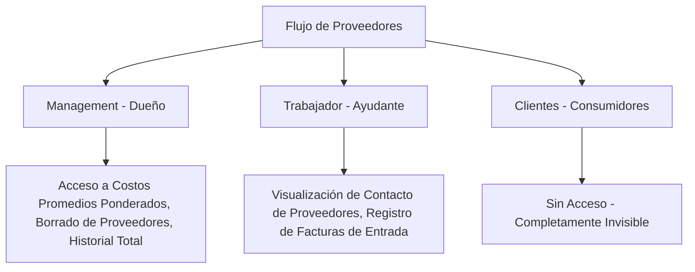

# Mejora 2: Módulo de Proveedores e Historial de Costos de Compra

Este módulo centraliza la información de los distribuidores y automatiza el ingreso de mercadería a la tienda, dividiendo claramente las tareas operativas entre el **Dueño (Management)**, sus **Ayudantes (Trabajador)** y resguardando los datos de los **Clientes**.

---

## 1. Funcionamiento del Backend (Base de Datos y Sistemas)

### Cambios en el Esquema de Supabase (SQL)
Estructuramos las tablas necesarias para soportar el directorio de distribuidores y los recibos de mercadería o reabastecimiento.

```sql
-- 1. Tabla de Proveedores
CREATE TABLE public.suppliers (
  id uuid DEFAULT gen_random_uuid() PRIMARY KEY,
  tenant_id uuid NOT NULL REFERENCES public.tenants(id) ON DELETE CASCADE,
  name text NOT NULL,
  contact_name text,
  phone text,
  email text,
  address text,
  is_active boolean DEFAULT true,
  created_at timestamp with time zone DEFAULT timezone('utc'::text, now())
);

-- 2. Tabla de Compras/Reabastecimiento
CREATE TABLE public.supplier_purchases (
  id uuid DEFAULT gen_random_uuid() PRIMARY KEY,
  tenant_id uuid NOT NULL REFERENCES public.tenants(id) ON DELETE CASCADE,
  supplier_id uuid REFERENCES public.suppliers(id) ON DELETE SET NULL,
  purchase_date timestamp with time zone DEFAULT timezone('utc'::text, now()),
  total_amount numeric(10,2) NOT NULL DEFAULT 0.00 CHECK (total_amount >= 0),
  status text NOT NULL DEFAULT 'completed' CHECK (status IN ('pending', 'completed', 'cancelled')),
  notes text,
  created_at timestamp with time zone DEFAULT timezone('utc'::text, now()),
  registered_by uuid REFERENCES public.profiles(id) ON DELETE SET NULL
);

-- 3. Detalle de los Productos Comprados
CREATE TABLE public.purchase_items (
  id uuid DEFAULT gen_random_uuid() PRIMARY KEY,
  purchase_id uuid NOT NULL REFERENCES public.supplier_purchases(id) ON DELETE CASCADE,
  product_id uuid NOT NULL REFERENCES public.products(id) ON DELETE CASCADE,
  quantity integer NOT NULL CHECK (quantity > 0),
  cost_price numeric(10,2) NOT NULL CHECK (cost_price >= 0)
);

-- Habilitar RLS en todas las nuevas tablas
ALTER TABLE public.suppliers ENABLE ROW LEVEL SECURITY;
ALTER TABLE public.supplier_purchases ENABLE ROW LEVEL SECURITY;
ALTER TABLE public.purchase_items ENABLE ROW LEVEL SECURITY;
```

### Seguridad y Aislamiento por Roles (Políticas RLS)
Políticas granulares que restringen el acceso a los datos de costos de compra:

```sql
-- Políticas para Proveedores (suppliers)
-- Clientes: Ningún tipo de acceso (Acceso Denegado por defecto).

-- Trabajadores: Pueden ver la lista de proveedores para llamarlos o coordinar entregas, y registrar nuevos. No pueden borrarlos.
CREATE POLICY "Workers can view and insert suppliers"
  ON public.suppliers FOR SELECT OR INSERT WITH CHECK (
    EXISTS (
      SELECT 1 FROM public.workers
      WHERE workers.tenant_id = suppliers.tenant_id
      AND workers.profile_id = auth.uid()
    )
  );

-- Management: Control total y absoluto (CRUD completo).
CREATE POLICY "Managers have full access to suppliers"
  ON public.suppliers FOR ALL USING (
    EXISTS (
      SELECT 1 FROM public.tenants
      WHERE tenants.id = suppliers.tenant_id
      AND tenants.owner_id = auth.uid()
    )
  );

-- Políticas para Compras y Detalles (supplier_purchases y purchase_items)
-- Clientes: Ningún tipo de acceso.

-- Trabajadores: Pueden registrar facturas de compra y restock para aumentar inventario. No pueden modificar compras pasadas.
CREATE POLICY "Workers can view and insert purchases"
  ON public.supplier_purchases FOR SELECT OR INSERT WITH CHECK (
    EXISTS (
      SELECT 1 FROM public.workers
      WHERE workers.tenant_id = supplier_purchases.tenant_id
      AND workers.profile_id = auth.uid()
    )
  );

CREATE POLICY "Workers can view and insert purchase items"
  ON public.purchase_items FOR SELECT OR INSERT WITH CHECK (
    EXISTS (
      SELECT 1 FROM public.supplier_purchases
      JOIN public.workers ON workers.tenant_id = supplier_purchases.tenant_id
      WHERE supplier_purchases.id = purchase_items.purchase_id
      AND workers.profile_id = auth.uid()
    )
  );

-- Management: Control total para auditar, cancelar o corregir transacciones de compra.
CREATE POLICY "Managers have full access to purchases"
  ON public.supplier_purchases FOR ALL USING (
    EXISTS (
      SELECT 1 FROM public.tenants
      WHERE tenants.id = supplier_purchases.tenant_id
      AND tenants.owner_id = auth.uid()
    )
  );

CREATE POLICY "Managers have full access to purchase items"
  ON public.purchase_items FOR ALL USING (
    EXISTS (
      SELECT 1 FROM public.supplier_purchases
      JOIN public.tenants ON tenants.id = supplier_purchases.tenant_id
      WHERE supplier_purchases.id = purchase_items.purchase_id
      AND tenants.owner_id = auth.uid()
    )
  );
```

---

## 2. Funcionamiento del Frontend (UI/UX)

### Interfaces de Usuario por Rol



#### A. Vista de Management (Dueño del Negocio)
* **Directorio de Proveedores Administrativo:**
  - Puede crear, editar y eliminar proveedores.
  - Ve métricas de cuánta mercancía se le ha comprado a cada distribuidor en un rango de fechas.
* **Historial Contable de Compras:**
  - Accede a una pantalla donde se detalla el listado de reabastecimientos.
  - Al ingresar al detalle de una compra, puede ver la comparativa de costos anteriores y cómo influyó la compra en el **Costo Promedio Ponderado** del producto.
  - Dispone de un botón de "Anular Compra" que revierte de forma automática el stock y notifica si hay inconsistencias.

#### B. Vista de Trabajador (Ayudante del Dueño)
* **Directorio de Contacto Operativo:**
  - Dispone de una agenda limpia donde puede ver Nombre, Dirección y Teléfono de los proveedores para hacer pedidos telefónicos.
  - Al tocar el teléfono, se abre una acción rápida de llamada o inicio de chat por WhatsApp.
* **Formulario de Registro de Mercadería ("Ingreso por Compra"):**
  - Cuando llega un camión de reabastecimiento, el trabajador selecciona el proveedor y los productos recibidos.
  - Digita las cantidades físicas recibidas y los costos unitarios que figuran en la factura física de compra.
  - Registra notas (ej. *"Llegó mercadería con empaque húmedo"*).
  - Al presionar "Completar Ingreso", el stock físico del local se incrementa de inmediato para que los clientes puedan comprar en línea.
  - *Restricción:* Una vez guardado el ingreso de stock, el trabajador no puede modificar ni borrar la compra. Cualquier error debe ser escalado al dueño.

#### C. Vista del Cliente (Usuarios de la Tienda Web)
* **Sin Acceso:** Este módulo es puramente de backoffice administrativo y no es visible en la interfaz pública de los clientes, garantizando la privacidad de los costos y los márgenes del negocio.
