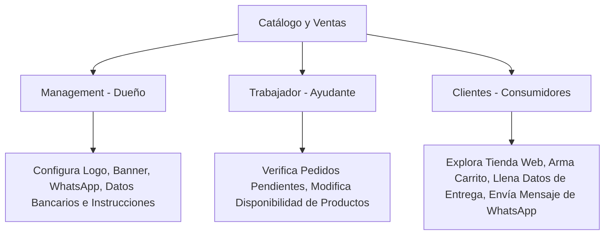

# Mejora 3: Catálogo Web de WhatsApp con Checkout Manual

Esta mejora permite auto-generar un portal de ventas público responsivo para cada negocio, estructurando las interacciones para el **Dueño (Management)**, los **Ayudantes (Trabajador)** y los **Compradores (Clientes)** sin depender de pasarelas de pago automatizadas.

---

## 1. Funcionamiento del Backend (Base de Datos y Sistemas)

### Cambios en el Esquema de Supabase (SQL)
Agregamos campos a la tabla `tenants` para la personalización estética del catálogo y los datos de recepción de pagos manuales.

```sql
-- Extensión de la tabla de configuraciones de tenants
ALTER TABLE public.tenants
  ADD COLUMN IF NOT EXISTS whatsapp_number text, -- Número completo con código de país
  ADD COLUMN IF NOT EXISTS whatsapp_enabled boolean DEFAULT true,
  ADD COLUMN IF NOT EXISTS currency_symbol text DEFAULT '$',
  ADD COLUMN IF NOT EXISTS catalog_cover_url text, -- Banner superior
  ADD COLUMN IF NOT EXISTS shipping_cost numeric(10,2) DEFAULT 0.00 CHECK (shipping_cost >= 0),
  ADD COLUMN IF NOT EXISTS manual_payment_instructions text; -- Datos bancarios para transferencias
```

### Seguridad y Aislamiento por Roles (Políticas RLS)
Políticas granulares para la configuración del catálogo:

```sql
-- Políticas para la configuración del catálogo (Tabla tenants)
-- Clientes (Público): Pueden leer la configuración básica para renderizar el catálogo web (lectura pública)
CREATE POLICY "Public read of active tenant catalog configuration"
  ON public.tenants FOR SELECT USING (is_active = true);

-- Trabajadores: Pueden visualizar la configuración y copiar el enlace, pero no editar las cuentas bancarias o el teléfono de WhatsApp comercial
CREATE POLICY "Workers can view tenant configuration"
  ON public.tenants FOR SELECT USING (
    EXISTS (
      SELECT 1 FROM public.workers
      WHERE workers.tenant_id = tenants.id
      AND workers.profile_id = auth.uid()
    )
  );

-- Management: Control total para modificar datos del negocio, cuentas bancarias de cobro manual e imagen corporativa
CREATE POLICY "Managers can update tenant configuration"
  ON public.tenants FOR ALL USING (auth.uid() = owner_id);
```

---

## 2. Funcionamiento del Frontend (UI/UX)

### Interfaces de Usuario por Rol



#### A. Vista de Management (Dueño del Negocio)
* **Consola de Configuración de Marca:**
  - Puede subir el logo y banner del catálogo.
  - Configura el número comercial de WhatsApp de destino donde llegarán los pedidos.
  - **Instrucciones de Pago Manual:** Un editor de texto enriquecido donde digita los datos bancarios:
    ```text
    Banco Pichincha - Cuenta Corriente: 2200445566 (Titular: Juan Pérez) - Enviar comprobante de transferencia.
    ```
  - Define el costo del servicio de entrega a domicilio (`shipping_cost`).
  - Obtiene el botón "Compartir Enlace" que copia la URL exclusiva a redes sociales en un solo toque.

#### B. Vista de Trabajador (Ayudante del Dueño)
* **Gestión Operativa de la Tienda:**
  - Puede ver en su panel de Flutter los pedidos que van ingresando como `pending` para comenzar a empaquetarlos.
  - **Control de Disponibilidad:** Si en el local físico se agota un ingrediente o artículo, el trabajador puede desactivar temporalmente el producto en la app (`is_active = false`) para que desaparezca instantáneamente del catálogo público de los clientes, evitando ventas de productos agotados.
  - *Restricción:* No tiene acceso para modificar el número de WhatsApp de destino ni los datos bancarios del negocio.

#### C. Vista del Cliente (Usuarios de la Tienda Web)
El consumidor accede a una landing responsiva web fluida y de carga rápida:
1. **Exploración de Productos:**
   - Visualiza los artículos organizados en pestañas por categorías.
   - Ve el costo del envío de forma transparente en la cabecera.
2. **Carrito de Compras y Formulario de Pedido:**
   - Incrementa o decrementa cantidades con respuesta táctil.
   - Presiona "Proceder al Pedido" y completa el formulario móvil:
     - Nombre Completo y Celular.
     - Dirección de entrega (o retiro en local).
     - Método de Pago Manual seleccionado: *Efectivo contra entrega* o *Transferencia bancaria* (donde la UI despliega las instrucciones bancarias cargadas por el dueño).
3. **Redirección Automatizada:**
   - Al tocar "Confirmar por WhatsApp", la web registra el pedido en Supabase en estado `pending` y abre WhatsApp con un mensaje pre-estructurado:
     ```text
     🛒 *NUEVO PEDIDO - [Nombre Negocio]* 
     
     Hola, me gustaría comprar:
     • 2x Artículo A ($10.00)
     ------------------------------------------
     🚚 Entrega: A Domicilio ($2.00)
     💰 *TOTAL: $12.00*
     
     📍 *Entrega:*
     • Cliente: María Pérez
     • Dirección: Calle Falsa 123
     • Pago: Transferencia Bancaria
     
     🔗 Estado de mi pedido: 
     https://pedidos.online/seguimiento/ORDER_ID
     ```
