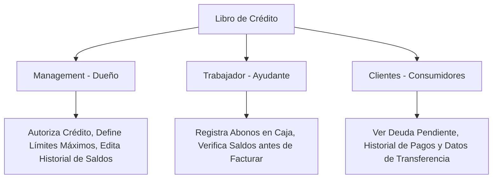

# Mejora 4: Libro de Crédito a Clientes (Control de "Fiado" y Cuentas por Cobrar)

Esta funcionalidad permite digitalizar de forma segura el control de saldos pendientes y cuentas corrientes de clientes recurrentes, definiendo los privilegios de uso para el **Dueño (Management)**, los **Ayudantes (Trabajador)** y los **Compradores (Clientes)**.

---

## 1. Funcionamiento del Backend (Base de Datos y Sistemas)

### Cambios en el Esquema de Supabase (SQL)
Estructuramos las cuentas corrientes dentro del tenant multi-tenant con aislamiento riguroso:

```sql
-- 1. Campos adicionales en la relación cliente-tenant
ALTER TABLE public.tenant_clients
  ADD COLUMN IF NOT EXISTS credit_limit numeric(10,2) DEFAULT 0.00 CHECK (credit_limit >= 0),
  ADD COLUMN IF NOT EXISTS current_debt numeric(10,2) DEFAULT 0.00 CHECK (current_debt >= 0),
  ADD COLUMN IF NOT EXISTS is_credit_approved boolean DEFAULT false;

-- 2. Tabla del Libro diario de Crédito
CREATE TABLE public.client_credit_ledger (
  id uuid DEFAULT gen_random_uuid() PRIMARY KEY,
  tenant_id uuid NOT NULL REFERENCES public.tenants(id) ON DELETE CASCADE,
  client_id uuid NOT NULL REFERENCES public.profiles(id) ON DELETE CASCADE,
  amount numeric(10,2) NOT NULL, -- Positivo (+) para cargos o compras al fiado, Negativo (-) para abonos
  transaction_type text NOT NULL CHECK (transaction_type IN ('charge', 'payment', 'adjustment')),
  reference_order_id uuid REFERENCES public.orders(id) ON DELETE SET NULL,
  notes text,
  created_at timestamp with time zone DEFAULT timezone('utc'::text, now()),
  created_by uuid REFERENCES public.profiles(id) ON DELETE SET NULL
);

-- Habilitar RLS en la tabla del libro diario de crédito
ALTER TABLE public.client_credit_ledger ENABLE ROW LEVEL SECURITY;
```

### Seguridad y Aislamiento por Roles (Políticas RLS)
Políticas de acceso según el tipo de usuario:

```sql
-- Políticas para Libro de Crédito (client_credit_ledger)
-- Clientes: Solo pueden VER sus propios movimientos e historial de cuenta corriente (Lectura estricta)
CREATE POLICY "Clients can view their own credit ledger"
  ON public.client_credit_ledger FOR SELECT USING (client_id = auth.uid());

-- Trabajadores: Pueden visualizar el historial de abonos y agregar cargos o registrar abonos de dinero
CREATE POLICY "Workers can view and insert credit entries"
  ON public.client_credit_ledger FOR SELECT OR INSERT WITH CHECK (
    EXISTS (
      SELECT 1 FROM public.workers
      WHERE workers.tenant_id = client_credit_ledger.tenant_id
      AND workers.profile_id = auth.uid()
    )
  );

-- Management: Control absoluto (Lectura, Inserción, Edición o eliminación de ajustes contables)
CREATE POLICY "Managers have full access to credit ledger"
  ON public.client_credit_ledger FOR ALL USING (
    EXISTS (
      SELECT 1 FROM public.tenants
      WHERE tenants.id = client_credit_ledger.tenant_id
      AND tenants.owner_id = auth.uid()
    )
  );
```

### Trigger de Automatización Contable
Mantiene actualizado el saldo neto del deudor tras cada entrada en el libro de créditos:

```sql
CREATE OR REPLACE FUNCTION public.update_tenant_client_debt()
RETURNS TRIGGER AS $$
BEGIN
  UPDATE public.tenant_clients
  SET current_debt = current_debt + NEW.amount
  WHERE tenant_id = NEW.tenant_id AND profile_id = NEW.client_id;
  RETURN NEW;
END;
$$ LANGUAGE plpgsql SECURITY DEFINER;

CREATE TRIGGER on_credit_ledger_change
  AFTER INSERT ON public.client_credit_ledger
  FOR EACH ROW
  EXECUTE FUNCTION public.update_tenant_client_debt();
```

---

## 2. Funcionamiento del Frontend (UI/UX)

### Interfaces de Usuario por Rol



#### A. Vista de Management (Dueño del Negocio)
* **Autorización Contable:**
  - Dispone de una pestaña en la ficha de cada cliente en `management_clients_screen.dart`.
  - Habilita mediante un Switch si el cliente está *"Aprobado para Comprar a Crédito"*.
  - Configura el **Límite de Crédito** (ej: `$200.00`).
* **Auditoría Global:**
  - Ve una tarjeta general con la sumatoria de las cuentas por cobrar totales y un listado de clientes en mora ordenados por monto de deuda.
  - Puede modificar o corregir registros del libro en caso de un error contable.

#### B. Vista de Trabajador (Ayudante del Dueño)
* **Control en Caja Física:**
  - Al facturar una orden de venta presencial, si el cliente solicita "Fiar", el trabajador puede seleccionar el método de pago *"Crédito de Confianza"*.
  - *Validación en tiempo real:* El sistema verifica si el cliente tiene el crédito aprobado por el dueño y si la nueva compra no sobrepasa el límite disponible. Si lo sobrepasa, la app bloquea la transacción con una alerta visual en rojo.
* **Registro Rápido de Abonos:**
  - Cuando un cliente se acerca al local a pagar su deuda, el trabajador abre su ficha, toca el botón **"Registrar Abono"**, ingresa el monto recibido en efectivo y guarda el recibo. El saldo del cliente se actualiza de inmediato.

#### C. Vista del Cliente (Usuarios de la Tienda)
* **Portal Privado de Cuenta Corriente:**
  - El cliente inicia sesión en su panel personal y visualiza su tarjeta de crédito del local con su deuda actual: *"Tu saldo pendiente es de: $34.50"*.
  - **Historial Transparente:** Puede ver la lista cronológica de en qué fechas compró y cuándo se registraron sus abonos, dando transparencia al proceso y evitando discusiones sobre cuentas mal llevadas.
  - **Datos de Pago Rápidos:** Visualiza directamente los datos de transferencia del dueño para pagar su deuda cómodamente desde su casa.
