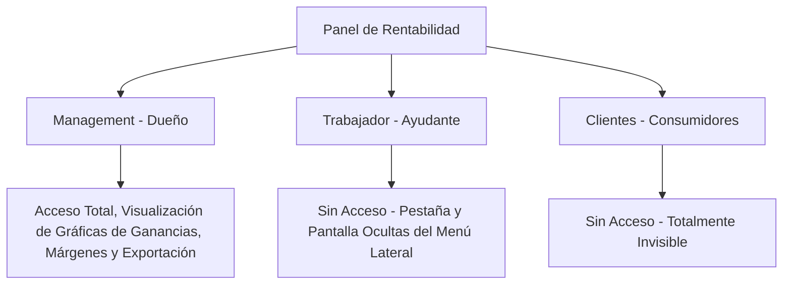

# Mejora 5: Panel de Rentabilidad Real y Analíticas Financieras

Este panel estratégico permite cruzar los costos de adquisición de mercancía con los precios de venta final para obtener la salud financiera real del negocio, aislando la información sensible para el **Dueño (Management)**, restringiéndola para el **Ayudante (Trabajador)** y los **Clientes**.

---

## 1. Funcionamiento del Backend (Base de Datos y Sistemas)

### Lógica de Cálculos e Historial Financiero
Para calcular la rentabilidad real sin distorsión, cada ítem de venta registrado en `order_items` debe congelar el `unit_cost_price` (costo de compra) al momento exacto de la venta.

#### Cambios en el Esquema de Supabase (SQL)
```sql
-- Extensión de la tabla de detalles de pedido
ALTER TABLE public.order_items
  ADD COLUMN IF NOT EXISTS unit_cost_price numeric(10,2) DEFAULT 0.00 CHECK (unit_cost_price >= 0);
```

#### Trigger automático en Supabase
```sql
CREATE OR REPLACE FUNCTION public.stamp_product_cost_on_sale()
RETURNS TRIGGER AS $$
DECLARE
  current_cost numeric(10,2);
BEGIN
  -- Obtener el costo unitario de compra actual del producto en catálogo
  SELECT cost_price INTO current_cost
  FROM public.products
  WHERE id = NEW.product_id;

  -- Asignar el costo unitario para congelarlo históricamente
  NEW.unit_cost_price := COALESCE(current_cost, 0.00);
  RETURN NEW;
END;
$$ LANGUAGE plpgsql SECURITY DEFINER;

CREATE TRIGGER on_order_item_create_stamp_cost
  BEFORE INSERT ON public.order_items
  FOR EACH ROW
  EXECUTE FUNCTION public.stamp_product_cost_on_sale();
```

### Seguridad y Aislamiento por Roles (Políticas RLS)
La información financiera de utilidades y costos de adquisición es altamente confidencial.

```sql
-- Solo el rol Management (Dueño del negocio) puede consultar la función de rentabilidad o ver unit_cost_price
-- Trabajadores y Clientes: Acceso denegado por defecto.

-- 1. Política de lectura en order_items para unit_cost_price
CREATE POLICY "Only managers can view unit cost prices"
  ON public.order_items FOR SELECT USING (
    EXISTS (
      SELECT 1 FROM public.tenants
      WHERE tenants.id = (SELECT tenant_id FROM public.orders WHERE orders.id = order_items.order_id)
      AND tenants.owner_id = auth.uid()
    )
  );

-- 2. Función RPC para cálculo del Reporte Financiero (Seguridad de Ejecutor)
CREATE OR REPLACE FUNCTION public.get_tenant_profitability_report(
  p_tenant_id uuid,
  p_start_date timestamp with time zone,
  p_end_date timestamp with time zone
)
RETURNS TABLE (
  total_revenue numeric,
  total_cost numeric,
  net_profit numeric,
  profit_margin_percentage numeric
) AS $$
BEGIN
  -- Validar que el usuario que ejecuta la consulta sea el OWNER (Management) del Tenant
  IF NOT EXISTS (
    SELECT 1 FROM public.tenants 
    WHERE id = p_tenant_id AND owner_id = auth.uid()
  ) THEN
    RAISE EXCEPTION 'Acceso Denegado: Solo el dueño de la tienda puede consultar reportes financieros.';
  END IF;

  RETURN QUERY
  SELECT 
    COALESCE(SUM(o.total_amount), 0.00) as total_revenue,
    COALESCE(SUM(oi.quantity * oi.unit_cost_price), 0.00) as total_cost,
    COALESCE(SUM(o.total_amount) - SUM(oi.quantity * oi.unit_cost_price), 0.00) as net_profit,
    CASE 
      WHEN SUM(o.total_amount) > 0 THEN 
        ROUND(((SUM(o.total_amount) - SUM(oi.quantity * oi.unit_cost_price)) / SUM(o.total_amount) * 100), 2)
      ELSE 0.00
    END as profit_margin_percentage
  FROM public.orders o
  JOIN public.order_items oi ON oi.order_id = o.id
  WHERE o.tenant_id = p_tenant_id
    AND o.status = 'approved'
    AND o.created_at BETWEEN p_start_date AND p_end_date;
END;
$$ LANGUAGE plpgsql SECURITY DEFINER;
```

---

## 2. Funcionamiento del Frontend (UI/UX)

### Interfaces de Usuario por Rol



#### A. Vista de Management (Dueño del Negocio)
Es el único rol que tiene acceso a esta sección estratégica.
* **Dashboard Financiero de Alta Gama (Glassmorphic):**
  - Muestra tres paneles coloridos en degradé: **Ingresos Totales** (Púrpura), **Inversión/Costo** (Amarillo) y **Utilidad Neta Real** (Verde Esmeralda).
  - Un gráfico interactivo de líneas que compara las ventas brutas diarias vs. las ganancias netas de la semana actual.
* **Top de Productos Rentables:**
  - Una lista interactiva de los artículos vendidos ordenada por porcentaje de margen real.
* **Exportación de Datos:**
  - Botón premium para generar reportes en PDF y archivos CSV listos para compartir con contadores mediante WhatsApp.

#### B. Vista de Trabajador (Ayudante del Dueño)
* **Restricción y Ocultación Absoluta:**
  - El menú lateral (`management_shell.dart`) filtra automáticamente las opciones según el rol del usuario conectado. Para los perfiles de tipo `worker` (trabajador), la sección "Finanzas" y "Rentabilidad" ni siquiera aparece en pantalla.
  - Si intentaran acceder directamente mediante una ruta profunda, el router de Flutter o el backend de Supabase lanzará una pantalla de error *"Acceso Restringido"*.

#### C. Vista del Cliente (Usuarios de la Tienda Web)
* **Sin Acceso:** Esta herramienta de inteligencia de negocios es de uso 100% privado para el dueño del negocio, manteniéndose completamente invisible para el público general.
